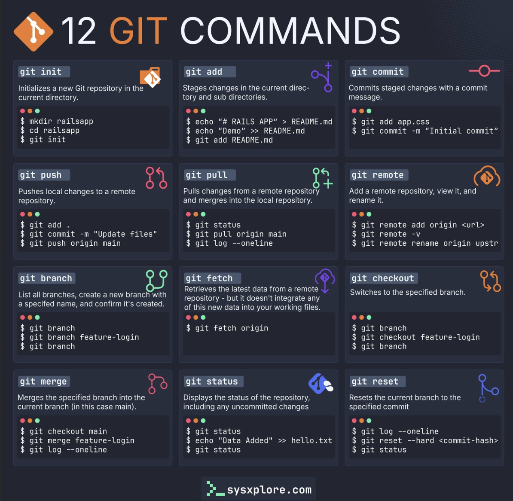

## Ciencia de datos

Esta sección reúne recursos de ciencia de datos: herramientas de trabajo (Quarto, Markdown, Github, VS Code, Google Colab, Jupyter), visualización de datos y mapas interactivos, inteligencia artificial y modelos de lenguaje.

:::::: mrw-cards-grid
::: mrw-card
::: mrw-card-header
[Ciencia de datos](cienciadedatos.qmd)
:::

::: mrw-card-body
Lecturas de referencia sobre ciencia de datos.
:::
:::

::: mrw-card
::: mrw-card-header
[Quarto](quarto.qmd)
:::

::: mrw-card-body
Atajos y recursos de ayuda para trabajar con Quarto.
:::
:::

::: mrw-card
::: mrw-card-header
[Myst](myst.qmd)
:::

::: mrw-card-body
Myst como alternativa a Quarto para publicación científica reproducible.
:::
:::

::: mrw-card
::: mrw-card-header
[Markdown](markdown.md)
:::

::: mrw-card-body
Introducción a la sintaxis de Markdown.
:::
:::

::: mrw-card
::: mrw-card-header
[Github](github.qmd)
:::

::: mrw-card-body
{.mrw-card-img}

Comandos y flujo de trabajo básico de Git y GitHub.
:::
:::

::: mrw-card
::: mrw-card-header
[Google Colab](google-colab.qmd)
:::

::: mrw-card-body
Recursos de ayuda para trabajar con Google Colab.
:::
:::

::: mrw-card
::: mrw-card-header
[Jupyter Notebook](jupyter-notebook.ipynb)
:::

::: mrw-card-body
Introducción al uso de Jupyter Notebook para ciencia de datos.
:::
:::

::: mrw-card
::: mrw-card-header
[Graficas Python y R](graficas-python-r.qmd)
:::

::: mrw-card-body
Recursos de visualización de datos con Python y R.
:::
:::

::: mrw-card
::: mrw-card-header
[Herramientas](herramientas.qmd)
:::

::: mrw-card-body
Lecturas y videos introductorios sobre herramientas de ciencia de datos.
:::
:::

::: mrw-card
::: mrw-card-header
[Inteligencia artificial](ia.qmd)
:::

::: mrw-card-body
Recursos de inteligencia artificial para el trabajo diario.
:::
:::

::: mrw-card
::: mrw-card-header
[VS Code](vs-code.qmd)
:::

::: mrw-card-body
Qué es Visual Studio Code y cómo aprovecharlo para ciencia de datos.
:::
:::

::: mrw-card
::: mrw-card-header
[Hugging Face](hugging-face.qmd)
:::

::: mrw-card-body
Qué es Hugging Face y su papel en el ecosistema de modelos de aprendizaje automático.
:::
:::

::: mrw-card
::: mrw-card-header
[Mapas](mapas/index.qmd)
:::

::: mrw-card-body
Mapas interactivos de Colombia con distintas tecnologías (Observable/TopoJSON, PMTiles, Tiles) y el Índice de Riesgo Nacional (NRI).
:::
:::

::: mrw-card
::: mrw-card-header
[D3](d3.qmd)
:::

::: mrw-card-body
D3, Observable y JavaScript para visualización de datos en la web.
:::
:::

::: mrw-card
::: mrw-card-header
[Experimento con D3](d3-experiment.qmd)
:::

::: mrw-card-body
Ejercicios prácticos con D3.js en Observable.
:::
:::

::: mrw-card
::: mrw-card-header
[Claude](claude.qmd)
:::

::: mrw-card-body
Recursos y cursos sobre Claude y la construcción de *agent skills*.
:::
:::

::: mrw-card
::: mrw-card-header
[Claude Skills (Slides)](claude-slides.qmd)
:::

::: mrw-card-body
Guía completa para construir *Skills* para Claude, en formato de presentación.
:::
:::
::::::
