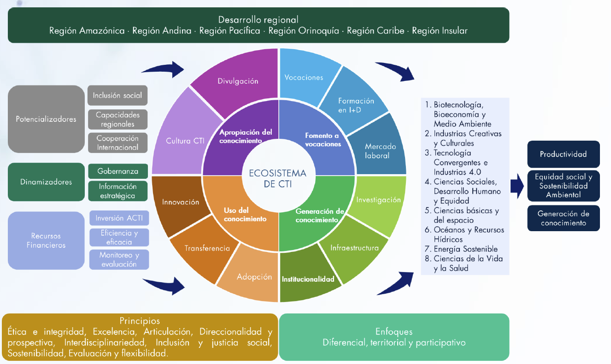

## Gestión de proyectos

Esta sección reúne recursos sobre la gestión de proyectos de desarrollo, ciencia, tecnología e innovación: desde los fundamentos de la disciplina y las herramientas de diagnóstico estratégico, hasta el análisis de actores, la gestión de riesgos, la gestión del conocimiento y la construcción de líneas base e indicadores.

:::::: mrw-cards-grid
::: mrw-card
::: mrw-card-header
[Liderazgo](liderazgo.qmd)
:::

::: mrw-card-body
Qué distingue al liderazgo de la administración, los principios de liderazgo de referentes como Drucker y Amazon, y su papel en la gestión de proyectos.
:::
:::

::: mrw-card
::: mrw-card-header
[Estrategia](estrategia.qmd)
:::

::: mrw-card-body
Qué es la estrategia según Porter, la diferencia entre estrategia deliberada y emergente (Mintzberg), y su uso para conectar el diagnóstico de un proyecto con la acción.
:::
:::

::: mrw-card
::: mrw-card-header
[Metodologías de gestión de proyectos](metodologias-pm.qmd)
:::

::: mrw-card-body
PMP y PRINCE2 frente a frente, su relación con enfoques ágiles y el marco lógico, y criterios para elegir la metodología según el tipo de proyecto.
:::
:::

::: mrw-card
::: mrw-card-header
[Gestión de proyectos de CTeI](gestionproyectosciencia.qmd)
:::

::: mrw-card-body
Particularidades de gestionar proyectos de ciencia, tecnología e innovación: formulación, financiación, seguimiento y evaluación en el contexto de la investigación aplicada.
:::
:::

::: mrw-card
::: mrw-card-header
[Gestión de tecnología e innovación](gestiontecnologiainnovacion.qmd)
:::

::: mrw-card-body
Cómo se gestiona la adopción, transferencia y escalamiento de tecnologías e innovaciones dentro de un proyecto o una organización.
:::
:::

::: mrw-card
::: mrw-card-header
[Impacto](impacto.qmd)
:::

::: mrw-card-body
Qué significa medir el impacto de un proyecto, cómo se diferencia de otros niveles de resultado (producto, efecto) y qué implica atribuir un cambio a una intervención.
:::
:::

::: mrw-card
::: mrw-card-header
[Mapa de actores](mapa-actores.qmd)
:::

::: mrw-card-body
Qué es y para qué sirve el análisis de actores antes de formular un proyecto de desarrollo: metodologías, matriz poder-interés y pasos para identificar, clasificar y relacionarse con los actores de un territorio.
:::
:::

::: mrw-card
::: mrw-card-header
[DOFA](dofa.qmd)
:::

::: mrw-card-body
Qué es la matriz DOFA (debilidades, oportunidades, fortalezas y amenazas), cómo se construye y cómo se usa para formular estrategias FO, DO, FA y DA.
:::
:::

::: mrw-card
::: mrw-card-header
[PESTEL](pestel.qmd)
:::

::: mrw-card-body
El análisis PESTEL de factores políticos, económicos, sociales, tecnológicos, ecológicos y legales del macroentorno de un proyecto u organización.
:::
:::

::: mrw-card
::: mrw-card-header
[SWOT](swot.qmd)
:::

::: mrw-card-body
La versión en inglés de la matriz DOFA (*Strengths, Weaknesses, Opportunities, Threats*) y su uso en la planeación estratégica internacional.
:::
:::

::: mrw-card
::: mrw-card-header
[Riesgos en proyectos](riesgos-proyectos.qmd)
:::

::: mrw-card-body
Cómo se construye una matriz de riesgos de proyecto paso a paso, el enfoque del PMBOK, tipos de matriz y las decisiones que se toman a partir de ella.
:::
:::

::: mrw-card
::: mrw-card-header
[Gestión del conocimiento](gestion-conocimiento.qmd)
:::

::: mrw-card-body
Qué es la gestión del conocimiento, el modelo de Nonaka y Takeuchi, el ciclo de gestión del conocimiento y la política de Gestión del Conocimiento y la Innovación de Función Pública en Colombia.
:::
:::

::: mrw-card
::: mrw-card-header
[Línea base](Linea-base.qmd)
:::

::: mrw-card-body
Cómo se construye una línea base y su relación con los indicadores y las metas en la Matriz de Marco Lógico, con ejemplos y errores frecuentes.
:::
:::

::: mrw-card
::: mrw-card-header
[CONPES](conpes.qmd)
:::

::: mrw-card-body
{.mrw-card-img}

Qué son los documentos CONPES, el manual metodológico del DNP para su elaboración y el papel de la gestión de riesgos en su seguimiento.
:::
:::
::::::
