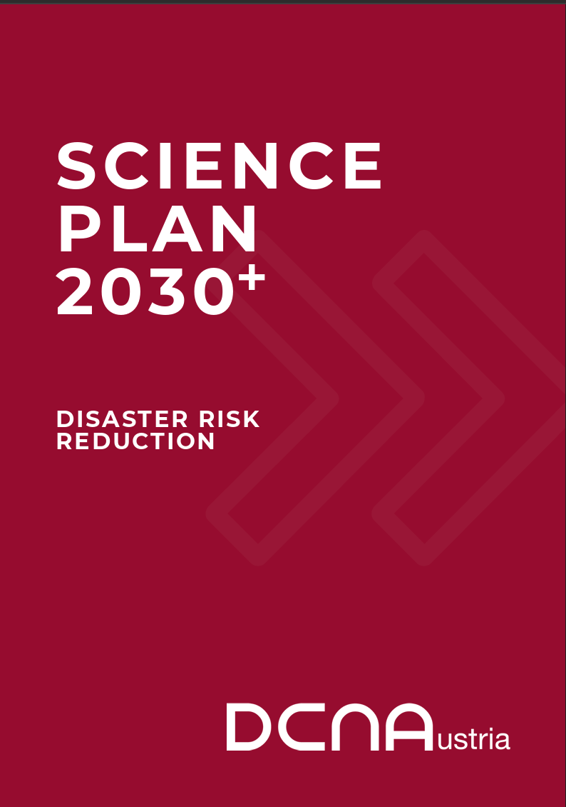
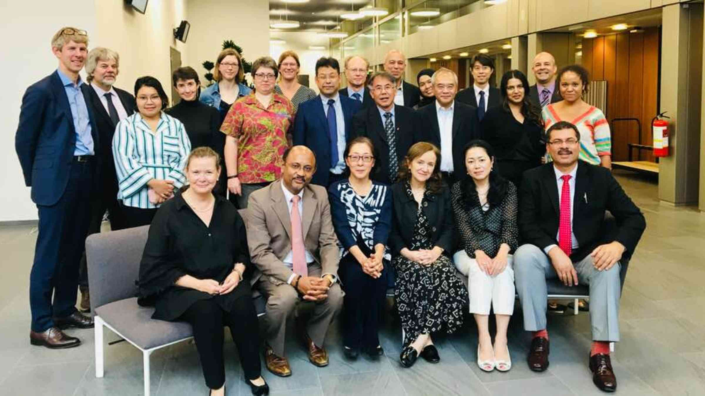

## Ciencia y Tecnología

Evolución de la agenda internacional de ciencia, tecnología e innovación para la reducción del riesgo de desastres en el marco del Marco de Sendai, 2015–2026. La secuencia muestra la transición desde la formulación de la Science & Technology Roadmap (2016) y su compromiso voluntario de implementación (2016–2021), hacia una agenda transversal orientada a la aplicación de conocimiento, datos, tecnologías emergentes, inteligencia artificial, innovación, sistemas de alerta temprana, conocimiento local y gobernanza del riesgo. El registro del compromiso como «Completed» en 2021 corresponde al cierre de dicho compromiso específico y no a la terminación de la Roadmap ni de la agenda de ciencia y tecnología del Marco de Sendai. Las fuentes enlazadas corresponden a documentos, plataformas y productos oficiales de UNDRR.

| Año | Hito / instrumento | Papel de ciencia, tecnología e innovación | Fuente oficial |
|-----------------|-----------------|--------------------|-----------------|
| **2015** | **Marco de Sendai para la RRD 2015–2030** | Establece la base política internacional para el uso de ciencia y tecnología, conocimiento científico, metodologías y herramientas, y para fortalecer la interfaz ciencia–política en la RRD. | [Marco de Sendai 2015–2030 – UNDRR](https://www.undrr.org/implementing-sendai-framework?utm_source=chatgpt.com) |
| **2016** | **Science & Technology Roadmap** | La comunidad científica y tecnológica establece una hoja de ruta para contribuir a las cuatro prioridades del Sendai mediante producción, síntesis, comunicación y utilización de evidencia científica y fortalecimiento de capacidades. | [Science & Technology Roadmap – UNDRR](https://sendaicommitments.undrr.org/system/files/sfvc/6c5a932e-0db5-4a8d-b2ad-0adb3cb1c6a0.pdf?utm_source=chatgpt.com) |
| **2016–2021** | **Science & Technology Commitment / STAG** | Se operacionaliza la Roadmap mediante un compromiso voluntario y la movilización de la comunidad científica y tecnológica internacional. | [Science Technology Commitment – UNDRR](https://sendaicommitments.undrr.org/commitment/science-technology-commitment-support-implementation-sendai-framework?utm_source=chatgpt.com) |
| **2021** | **Cierre del Science & Technology Commitment** | El compromiso voluntario es registrado como *Completed*. Esto **no significa que haya terminado la Roadmap ni la agenda de ciencia y tecnología del Sendai**; finaliza el compromiso específico. | [Science Technology Commitment – UNDRR](https://sendaicommitments.undrr.org/commitment/science-technology-commitment-support-implementation-sendai-framework?utm_source=chatgpt.com) |
| **2022** | **Evaluación y preparación del Midterm Review** | Se intensifica la evaluación de los avances, brechas y condiciones necesarias para que la ciencia y tecnología contribuyan efectivamente a la implementación del Sendai. | [MTR Sendai – contribuciones y documentos](https://sendaiframework-mtr.undrr.org/2023/mtr-sf-submissions-and-reports?utm_source=chatgpt.com) |
| **2023** | **Midterm Review del Sendai Framework** | Se produce un cambio conceptual: la cuestión deja de ser solamente generar conocimiento y pasa a ser **integrar la RRD en decisiones, inversiones y comportamiento**, atravesando sectores, disciplinas, geografías y escalas. | [Midterm Review – UNDRR](https://sendaiframework-mtr.undrr.org/publication/report-midterm-review-implementation-sendai-framework-disaster-risk-reduction-2015-2030?utm_source=chatgpt.com) |
| **2023** | **Early Warnings for All** | Ciencia, tecnología, datos, observación, predicción y comunicaciones pasan a integrarse en una iniciativa operacional global para que todas las personas estén protegidas por sistemas de alerta temprana multiamenaza. | [Early Warnings for All – UNDRR](https://www.undrr.org/early-warnings-for-all?utm_source=chatgpt.com) |
| **2024** | **Status of Science and Technology in DRR in Asia-Pacific 2024** | UNDRR continúa evaluando explícitamente la implementación de la **Science & Technology Roadmap**, pero ahora junto con EW4All, localización, innovación, infraestructura resiliente y emprendimiento. | [Status of Science and Technology in DRR Asia-Pacific 2024 – UNDRR](https://www.undrr.org/publication/status-science-and-technology-disaster-risk-reduction-asia-pacific-2024?utm_source=chatgpt.com) |
| **2024** | **Roorkee Declaration on Science and Technology for DRR** | La agenda científica y tecnológica se amplía hacia alerta temprana, localización, inclusión, gobernanza, ciudades, infraestructura resiliente, innovación y emprendimiento. | [Roorkee Declaration – UNDRR](https://www.undrr.org/publication/roorkee-declaration-science-and-technology-disaster-risk-reduction-2024?utm_source=chatgpt.com) |
| **2025** | **Global Platform for DRR 2025** | Ciencia y tecnología aparecen como **aceleradores de la implementación** del Sendai: datos, inteligencia para decisiones, tecnologías emergentes, IA, innovación, sistemas de alerta y *leapfrogging*. | [Global Platform 2025 – UNDRR](https://globalplatform.undrr.org/2025/?utm_source=chatgpt.com) |
| **2025** | **Sesión: Implementation of Sendai Framework – Role of Science and Technology** | La ciencia y tecnología se vinculan directamente con la **implementación local**, integrando IA, imágenes satelitales, GIS, modelos predictivos, sistemas de alerta, conocimiento local, gobernanza e inversión. | [Sesión Science & Technology – Global Platform 2025](https://globalplatform.undrr.org/2025/conference-event/implementation-sendai-framework-drr-role-science-and-technology-strengthening?utm_source=chatgpt.com) |
| **2025** | **From Data to Action** | El énfasis pasa de disponer de datos a transformarlos en **inteligencia para la toma de decisiones**, mediante interoperabilidad, gobernanza y colaboración. | [TS1-2 From Data to Action – Global Platform 2025](https://globalplatform.undrr.org/2025/conference-event/ts1-2-data-action-strengthening-understanding-disaster-impact-data-and-its?utm_source=chatgpt.com) |
| **2025** | **Development and Adoption of Technologies to Accelerate DRR** | Las tecnologías emergentes se presentan como instrumentos para **acelerar y corregir el rumbo** de la implementación del Sendai, incluyendo IA, transformación digital e innovación. | [TS1-3 Technologies – Global Platform 2025](https://globalplatform.undrr.org/2025/conference-event/ts1-3-development-and-adoption-technologies-accelerate-disaster-risk-reduction?utm_source=chatgpt.com) |
| **2025** | **Tech4DRR – Reporte Especial sobre el uso de la tecnología en la RRD** | **Nuevo hito clave.** La tecnología se aborda desde una perspectiva aplicada y contextual: observación de la Tierra, SAT, IA, aprendizaje automático, modelación y datos, pero también *low-tech*, accesibilidad, capacidades locales, conocimiento indígena y co-creación. El informe advierte que **la tecnología por sí sola no resuelve los desafíos de la RRD**. | [Reporte Especial sobre el uso de la tecnología en la RRD – UNDRR](https://www.undrr.org/es/publication/documents-and-publications/reporte-especial-sobre-el-uso-de-la-tecnologia-en-la?utm_source=chatgpt.com) |
| **2025** | **Geneva Call for Disaster Risk Reduction** | La GP2025 incorpora políticamente el uso de tecnologías emergentes, incluida IA, como mecanismo para **acelerar la RRD**, con énfasis en uso ético, acceso, inclusión y comunidades de última milla. | [Geneva Call for Disaster Risk Reduction – UNDRR](https://globalplatform.undrr.org/2025/publication/global-platform-2025-co-chairs-summary-geneva-call-disaster-risk-reduction?utm_source=chatgpt.com) |
| **2026** | **Fase de aceleración hacia 2030** | La agenda resultante es transversal: **ciencia + datos + IA + tecnología + innovación + conocimiento local + alerta temprana + gobernanza + financiación**, orientada a acelerar la segunda mitad de la implementación del Sendai. | [Science and Technology Community – UNDRR](https://www.undrr.org/implementing-sendai-framework/partners-and-stakeholders/science-and-technology-community?utm_source=chatgpt.com) |

### **Marco de Sendai**

El Marco de Sendai contiene varias referencias a . Por ejemplo:

- El párrafo 36(b) solicita: «Que la academia, las entidades y redes científicas y de investigación se centren en los factores y escenarios de riesgo de desastre, incluidos los riesgos emergentes, a mediano y largo plazo; incrementen la investigación para su aplicación regional, nacional y local; apoyen la acción de las comunidades y autoridades locales; y fomenten la interacción entre la política y la ciencia para la toma de decisiones».

- El párrafo 25(g) establece: "Mejorar la labor científica y técnica en materia de reducción del riesgo de desastres y su movilización mediante la coordinación de las redes existentes y las instituciones de investigación científica en todos los niveles y regiones, con el apoyo del Grupo Asesor Científico y Técnico de la UNISDR, con el fin de: fortalecer la base de evidencia que respalda la implementación de este marco; promover la investigación científica sobre los patrones, causas y efectos del riesgo de desastres; difundir información sobre riesgos, aprovechando al máximo la tecnología de la información geoespacial; brindar orientación sobre metodologías y estándares para la evaluación de riesgos, la modelización del riesgo de desastres y el uso de datos; identificar brechas en la investigación y la tecnología, y establecer recomendaciones para las áreas prioritarias de investigación en la reducción del riesgo de desastres; promover y apoyar la disponibilidad y aplicación de la ciencia y la tecnología en la toma de decisiones; contribuir a la actualización de la Terminología de la UNISDR de 2009 sobre Reducción del Riesgo de Desastres; utilizarla después de un desastre. "Las revisiones como oportunidades para mejorar el aprendizaje y las políticas públicas, y difundir estudios."

### **Hoja de Ruta de Ciencia y Tecnología para Apoyar la Implementación del Marco de Sendai para la Reducción del Riesgo de Desastres 2015-2030.**

La comunidad científica y tecnológica, junto con otras partes interesadas, se reunieron en la Conferencia de Ciencia y Tecnología de la Oficina de las Naciones Unidas para la Reducción del Riesgo de Desastres (UNISDR), celebrada del 27 al 29 de enero de 2016 en Ginebra. La Conferencia produjo la «Hoja de Ruta de Ciencia y Tecnología para Apoyar la Implementación del Marco de Sendai para la Reducción del Riesgo de Desastres 2015-2030» y las alianzas correspondientes como resultado principal. La Hoja de Ruta es un mecanismo para «fomentar la colaboración entre las comunidades científicas y otras partes interesadas a través de mecanismos e instituciones globales y regionales para la implementación y la coherencia de los instrumentos y herramientas pertinentes para la reducción del riesgo de desastres» en torno a objetivos y acciones comunes.

- The science and technology roadmap to support the implementation of the Sendai Framework for Disaster Risk Reduction 2015-2030. [*Link*](https://www.google.com/search?q=he+science+and+technology+roadmap+to+support+the+implementation+of+the+Sendai+Framework+for+Disaster+Risk+Reduction+2015-2030.&rlz=1C5OZZY_enCO1132CO1132&sourceid=chrome&ie=UTF-8#:~:text=The%20Science%20and,%E2%80%BA%20files%20%E2%80%BA%2065131_file).



### Scientific and Technical Advisory Group (STAG)

El propósito del [Grupo Asesor Científico y Técnico de la UNDRR](https://www.preventionweb.net/organization/scientific-and-technical-advisory-group?page=1) es brindar asesoramiento y apoyo técnico sustantivo para la formulación e implementación de las actividades llevadas a cabo por la amplia comunidad de la Estrategia Internacional para la Reducción del Riesgo de Desastres.

El Grupo Asesor Científico y Técnico se formó en 2012, sucediendo al Comité Científico y Técnico (CCT). Sus miembros provienen de todo el mundo y de diversas disciplinas científicas; la lista de miembros actuales se encuentra aquí.

**Objetivo de Reducción de Desastres.** La labor del Grupo Asesor Científico y Técnico abarca todos los aspectos de las dimensiones científicas y técnicas de la reducción de riesgos, con especial énfasis en las necesidades de los países en desarrollo. Específicamente, el Grupo Asesor Científico y Técnico se centrará en:

- Una mejor integración de la ciencia y la tecnología en las políticas.
- Mayor interacción entre las disciplinas científicas y técnicas.
- Promover una mayor colaboración internacional.
- Fortalecimiento de capacidades.
- Una perspectiva a largo plazo (de 30 a 40 años) sobre el riesgo.
- Modelización, mapeo y análisis de riesgos.
- Utilización de la evidencia sobre acciones de reducción de riesgos para facilitar la toma de decisiones.
- Percepción y comunicación del riesgo.

[**Science Technology Commitment to support implementation of Sendai Framework.**](https://sendaicommitments.undrr.org/commitment/science-technology-commitment-support-implementation-sendai-framework)

**Resultados esperados.** Los resultados esperados son los productos finales de la iniciativa/compromiso, que pueden incluir publicaciones o productos de conocimiento, resultados de talleres, programas de capacitación, videos, enlaces, fotografías, etc.

<!-- -->

::: panel-tabset
### **Prevention Web**

[![\[\[Science and technology Prevention Web\]\](https://www.preventionweb.net/knowledge-base/themes/science-knowledge-and-advocacy/science-and-technology))](../images/preventionwebscience.png){width="250"}](https://www.preventionweb.net/knowledge-base/themes/science-knowledge-and-advocacy/science-and-technology)

### **Framework Global Science**

{fig-align="left" width="250"}

[A Framework for Global Science in Support of Risk-Informed Sustainable Development and Planetary Health](https://www.irdrinternational.org/knowledge_pool/publications/91)

### **Reporte especial**

{fig-align="left" width="250"}

[Reporte Especial sobre el uso de la tecnología en la reducción del riesgo de desastres](https://www.undrr.org/es/publication/documents-and-publications/reporte-especial-sobre-el-uso-de-la-tecnologia-en-la)

### **Status Science Asia**

{fig-align="left" width="250"}

[A Status of Science and Technology in Disaster Risk Reduction in Asia-Pacific 2024](https://www.undrr.org/es/node/89065)

### **Science Plan Austria**

[{width="250"}](https://gadri.net/events/Austria_DCNA%20Science%20Plan%20EN.pdf)

SCIENCE PLAN 2030+ DISASTER RISK REDUCTION DCNA

### **STAG - PreventionWeb**

[{width="250"}](https://www.preventionweb.net/organization/scientific-and-technical-advisory-group?page=1)

Scientific and Technical Advisory Group (STAG) en PreventionWeb
:::

## Documentos de interés

- A framework for global science in support of risk-informed sustainable development and planetary health. 2021. [*Link*](https://www.undrr.org/publication/framework-global-science-support-risk-informed-sustainable-development-and-planetary).
- A Science Plan for Integrated Research on Disaster Risk. International Science Council. [*Link*](https://council.science/publications/a-science-plan-for-integrated-research-on-disaster-risk/).
- Implemetación del Marco de Sendai. UNDRR. [*Link*](https://www.undrr.org/implementing-sendai-framework-partners-and-stakeholders/science-and-technology-action-group).
- GFDRR Innovation. [*Link*](https://www.gfdrr.org/en/innovation)
- APRU Multi-Hazards. [*Link*](https://apru.org/our-work/pacific-rim-challenges/multi-hazards/).
- Prevention Web Science and Technology. [*Link*](https://www.preventionweb.net/themes/view/761#hits=20&sortby=default&view=pw&filter=themes%3A%5E%22Science+and+Technology%22%24).
- **30 innovations**
  - Disaster risk reduction and innovations. *Progress in Disaster Science*, 2019. [*Link*](https://www.sciencedirect.com/science/article/pii/S259006171930033X).
  - 30 Innovations linking disaster risk reduction with sustainable development goals. [*Link*](https://www.preventionweb.net/publications/view/70713).
  - 30 innovations for disaster risk reduction. [*Link*](https://www.preventionweb.net/publications/view/64473).
  - Applications of artificial intelligence for disaster management. *Natural Hazards,* 2020. [*Link*](https://link.springer.com/article/10.1007/s11069-020-04124-3).
- Disruptive technologies and their use in disaster risk reduction and management. ITU, 2019. [*Link*](https://www.preventionweb.net/publication/disruptive-technologies-and-their-use-disaster-risk-reduction-and-management).
- Building a safer society through science and technology: a compendium of Korea's science and technology-based disaster management. [*Link*](https://www.preventionweb.net/publication/documents-and-publications/building-safer-society-through-science-and-technology).

## **Lecturas**

- Exploring the emerging evolution trends of disaster risk reduction research: a global scenario. *International Journal of Environmental Science and Technology,* 2021. [*Link*](https://link.springer.com/article/10.1007/s13762-020-02847-1).
- Knowledge and Disaster Risk Reduction. *The Routledge Handbook of Hazards and Disaster Risk Reduction*. 2011. [*Link*](https://www.routledgehandbooks.com/doi/10.4324/9780203844236.ch9)
- Perspectives of Science and Technology in Disaster RiskReduction of Asia. 2016. International Journal of Disaster Risk Science. [*Link*](https://doi.org/10.1007/s13753-016-0104-7).
- Three innovative approaches for managing disaster risks. [*Link*](https://blogs.worldbank.org/sustainablecities/three-innovative-approaches-managing-disaster-risks).
- 2021 APRU Multi-Hazards Webinar Series: Health, Climate Change and Innovation in Disaster Risk Reduction. [*Link*](https://apru.org/event/2021-apru-multi-hazards-webinar-series-health-climate-change-and-innovation-in-disaster-risk-reduction/), [*link*](https://apru.org/wp-content/uploads/2021/10/MH-webinar_oct-2021.pdf).
- ADB and OECD. 2020. Leveraging Technology and Innovation for Disaster Risk Management and Financing. [*Link*](https://www.adb.org/sites/default/files/publication/664501/tech-innovation-disaster-risk-mgt-financing.pdf)
- Success, innovation and challenge: School safety and disaster education in South America and the Caribbean, 2020. [*Link*](https://www.sciencedirect.com/science/article/abs/pii/S2212420919305813).
- IRDR Compilation 2010-2020: A Ten Year Science Quest for Disaster Risk Reduction. [*Link*](https://www.irdrinternational.org/knowledge_pool/publications/868)
- The Integrated Research on Disaster Risk 2021 International Conference. [*Link.*](https://conference.irdrinternational.org/)
- Disaster Risk Science: A Geographical Perspective and a Research Framework. 2020. [*Link*](https://link.springer.com/article/10.1007/s13753-020-00296-5)
- Building a global forum for natural hazard science. NPJ. 2025. [*Link*](https://www.nature.com/articles/s44304-025-00130-2)
- Understanding Disaster Risk and Science and Technology. *Science and Technology in Disaster Risk Reduction in Asia*, 2018. [*Link*](https://www.sciencedirect.com/science/chapter/edited-volume/abs/pii/B978012812711700002X).
- Ensuring science is useful, usable and used in global DRR and sustainable development: a view through the Sendai framework lens. *Palgrave Communications*, 2016. [*Link*](https://www.nature.com/articles/palcomms201616).
- Words into Action guidelines: The Science–Policy–Society ecosystem for disaster risk reduction. UNDRR, 2024. [*Link*](https://www.undrr.org/publication/words-action-guidelines-science-policy-society-ecosystem-disaster-risk-reduction#downloads).
- ISC-UNDRR-RISK KAN Briefing Note on Systemic Risk. International Science Council, 2022. [*Link*](https://council.science/publications/briefing-systemic-risk/).

## **Videos**

::: {layout-ncol="2"}









:::

# **Inteligencia artificial en GRD**

## Lecturas

- Artificial intelligence for climate prediction of extremes: State of the art, challenges, and future perspectives. 2025. [*Link*](https://wires.onlinelibrary.wiley.com/doi/10.1002/wcc.914).

- Masterclass series: Leveraging artificial intelligence for disaster risk reduction. *Link*

- UNDRR. Artificial intelligence (AI) for disaster risk reduction. Collection. [*Link*](https://www.preventionweb.net/collections/artificial-intelligence-ai-disaster-risk-reduction)

::: {layout-ncol="2"}
 Introduction to Artificial Intelligence (AI)

 AI Applications for Multi-Hazard Early Warning Systems

 AI Applications for Urban Resilience and Risk Assessment

 Principles for the Ethical Use of AI for DRR by Governments
:::

::: {layout-ncol="2"}
 Geospatial Reasoning: Demonstration application

 This is how Google's Flood Hub uses AI forecasting to power local-level flood warnings \| UNDRR

 Artificial Intelligence for Remote Sensing applications: recent developments and main challenges

 AI for Weather and Climate Preparedness and Resilience
:::

- ESRI Geospatial AI platform. [*Link*](https://architecture.arcgis.com/en/overview/introduction-to-arcgis/geospatial-ai.html)

::: {layout-ncol="2"}
 GeoAI and GenAI in ArcGIS \| 2025 Esri UAE User Conference

 Maximise data insights with geospatial analysis & GeoAI Maximise data insights with geospatial analysis & GeoAI
:::

## Herramientas

- Google Geospatial Reasoning. [*Link*](https://research.google/blog/geospatial-reasoning-unlocking-insights-with-generative-ai-and-multiple-foundation-models/)

# Tecnologías geoespaciales

- Light detection and ranging of natural systems. Nature Reviews Methods Primers. 2025. [*Link*](https://www.nature.com/articles/s43586-025-00446-3)

# Cursos en ciencia y tecnología en grd

- Risk-informed governance and innovative technology for disaster risk reduction and resilience. UNDRR. [*Link*](https://unsec.unssc.org/course/view.php?id=309).
  - Unit 1: Risk-Informed Governance for DRR and Resilience
  - Unit 2: Science Technology and Government Innovation in Public Governance for DRR and Resilience
  - Unit 3: Practical and Planned Application of Emerging Technology and Government Innovation for DRR and Resilience
  - Unit 4: Implementation of Emerging Technologies and Government Innovation for DRR and Resilience
  - Unit 5: Reflecting on and Planning for Monitoring and Evaluation (optional)
  - Unit 6:Case Studies - Application of Technology for Reducing Disaster Risks

::: {layout-ncol="2"}
 eLearning Course: Risk-informed Governance and Innovative Technology for DRR and Resilience

 Session 6: Government Innovation and Technologies for DRR and Resilience (22 Sep 2020)
:::

# Libros de referencia internacionales

- The Routledge Handbook of Hazards and Disaster Risk Reduction. 2012. [*Link*](https://www.routledgehandbooks.com/doi/10.4324/9780203844236).
- The Routledge Handbook of Disaster Risk Reduction Including Climate Change Adaptation. 2017. [*Link*](https://books.google.com.co/books?id=4mgPEAAAQBAJ).
- Crisis and Emergency Management: Theory and Practice, Second Edition. 2017. [*Link*](https://books.google.com.co/books?id=cq1JDwAAQBAJ).
- Extreme Natural Hazards, Disaster Risks and Societal Implications. 2014. [*Link*](https://books.google.com.co/books?hl=es&lr=&id=XzE4AwAAQBAJ).
- Encyclopedia of Natural Hazards. 2013. [*Link*](https://link.springer.com/referencework/10.1007/978-1-4020-4399-4).
- Encyclopedia of Natural Hazard Science. OUP. [*Link*](https://oxfordre.com/naturalhazardscience/).
- Education for Sustainable Development and Disaster Risk Reduction. 2014. [*Link*](https://books.google.com.co/books?id=SCM9BAAAQBAJ).
- Integrated Research on Disaster Risks. Springer. 2021. [*Link*](https://link.springer.com/book/10.1007/978-3-030-55563-4#:~:text=Integrated%20Research%20on%20Disaster%20Risk,Disaster%20Risk%20Reduction%20(UNDRR).).
- Introduction to Catastrophe Risk Modelling. A Physics-based Approach. 2025. [*Link*](https://www.cambridge.org/highereducation/books/introduction-to-catastrophe-risk-modelling/A3A5B5FB990921422BFEBB07734BF869#overview)*. [Link](https://github.com/amignan/Intro2CATriskModelling)*
- Natural Hazards, Second Edition: Explanation and Integration. 2017. [*Link*](https://books.google.com.co/books?hl=es&lr=&id=gw_kDAAAQBAJ&oi=fnd&pg=PP1&dq=Natural+Hazard+risk&ots=DJenfdnkZr&sig=uZnu_qPSrYCKlBryI0KZc6qEdDY&redir_esc=y#v=onepage&q&f=false).
- Natural Hazards and Disasters. Fifth Ed. Hyndman. 2017. [*Link*](https://books.google.com.co/books?id=nMgaCgAAQBAJ).
- Natural Catastrophe Risk Management and Modelling: A Practitioner's Guide. [*Link*](https://books.google.com.co/books?hl=es&lr=&id=PEK9DgAAQBAJ&oi=fnd&pg=PT10&dq=Introduction+to+Catastrophe+Risk+Modelling&ots=FWhyN1yDl3&sig=1wVjLKtlgPMqLfs9FrItbKG73a8&redir_esc=y#v=onepage&q&f=false)
- The Role of Ecosystems in Disaster Risk Reduction. 2013. [*Link*](https://books.google.com.co/books?id=9mTRjKmN1LwC). \*\*\*
- Social Vulnerability to Disasters, Second Edition. 2013. [*Link*](https://books.google.com.co/books?id=onAWhiaVsuIC&printsec=frontcover&dq=social+vulnerability+to+disasters&hl=es-419&sa=X&redir_esc=y#v=onepage&q&f=false).
- Systemic Risk: History, Measurement and Regulation. 2019. [*Link*](https://www.worldscientific.com/worldscibooks/10.1142/11301#t=aboutBook).
- Systemic Disaster Risk Handbook. [*2021*](https://knowledge.aidr.org.au/resources/handbook-disaster-risk/)
- Sustainable Development and Disaster Risk Reduction. 2016. [*Link*](https://books.google.com.co/books?id=79bjCgAAQBAJ).
- Natural Climate Solutions Handbook: A Technical Guide for Assessing NatureBased Mitigation Opportunities in Countries. 2021. [*Link*](https://www.nature.org/content/dam/tnc/nature/en/documents/TNC_Natural_Climate_Solutions_Handbook.pdf).
- The Invention of Disaster. Power and Knowledge in Discourses on Hazard and Vulnerability. Routledge. 2022. [*Link*](https://www.routledge.com/The-Invention-of-Disaster-Power-and-Knowledge-in-Discourses-on-Hazard-and/Gaillard/p/book/9781138805620#).
- Creating Resilient Futures. Integrating Disaster Risk Reduction, Sustainable Development Goals and Climate Change Adaptation Agendas. 2022. Springer. [*Link*](https://link.springer.com/book/10.1007/978-3-030-80791-7).
- Handbook on Climate Change and Disasters. 2023. [*Link*](https://books.google.com.co/books?id=vW-VEAAAQBAJ&lpg=PP1&hl=es&pg=PR5#v=onepage&q&f=false).
- Disaster Risk Reduction for Resilience. Climate Change and Disaster Risk Adaptation. 2023. [*Link*](https://link.springer.com/book/10.1007/978-3-031-22112-5)
- Física del caos en la predicción meteorológica. 2023. AEMET España. [*Link*](https://www.aemet.es/es/conocermas/recursos_en_linea/publicaciones_y_estudios/publicaciones/detalles/Fisica_del_caos_en_la_predicc_meteo).
- **Lecturas sobre conceptos**
  - Managing the Risks of Extreme Events and Disasters to Advance Climate Change Adaptation. IPCC. 2012. [*Link*](https://www.ipcc.ch/report/managing-the-risks-of-extreme-events-and-disasters-to-advance-climate-change-adaptation/).
    - Chapter 2. Determinants of risk: exposure and **vulnerability**. [*Link*](https://www.researchgate.net/publication/244062037_Determinants_of_risk_exposure_and_vulnerability).
    - Gestión de los riesgos de fenómenos meteorológicos extremos y desastres para mejorar la adaptación al cambio climático. IPCC, 2012. [*Link*](https://www.ipcc.ch/site/assets/uploads/2018/03/IPCC_SREX_ES_web-1.pdf). [*Link*](https://www.ipcc.ch/report/managing-the-risks-of-extreme-events-and-disasters-to-advance-climate-change-adaptation/).
  - Briefing note on systemic risk. UNDRR, 2022. [*Link*](https://floodresilience.net/resources/item/briefing-note-on-systemic-risk/).
  - A framework for complex climate change risk assessment. One Earth. 2021. [Link](https://www.cell.com/one-earth/fulltext/S2590-3322(21)00179-2).

::: {layout-ncol="2"}
 Systemic Disaster Risk Handbook

 Climate change and disaster risk management

 Los desastres no son naturales
:::

# **Institutos y organizaciones internacionales**

- APRU – Association of Pacific Rim Universities. [*Link*](https://apru.org/).
- Center for Emergency Management and Homeland Security. ASU. [*Link*](https://cemhs.asu.edu/).
- Columbia Climate School. [*Link*](https://climate.columbia.edu/research).
- DesignSafe CI. [*Link*](https://www.designsafe-ci.org/#learning)
- FAO Ciencia, tecnología e innovación. [*Link*](https://www.fao.org/science-technology-and-innovation/about/es).
- GADRI – Global Aliance of Disaster Risk Institutes. [*Link*](https://gadri.net/).
- Global Assessment Repo. [Link](https://gar.unisdr.org/).
- Harvard Humanitarian Initiative. [*Link*](https://hhi.harvard.edu/).
- Hazards & Vulnerability Research Institute. [Link](http://artsandsciences.sc.edu/geog/hvri/front-page). [Link](https://www.youtube.com/channel/UCQ22ABWTJkxolMXLAnLKMLQ/videos).
- Integrated Research on Disaster Risk International Center of Excellence Vulnerability and Resilience Metrics. [*Link*](http://www.irdrinternational.org/)
- Integrated Research on Disaster Risk (IRDR). [*Link*](https://www.irdrinternational.org/) [*Link*](https://council.science/what-we-do/research-programmes/thematic-organizations/integrated-research-on-disaster-risk-irdr/).
- International Science Council. [Link](https://council.science/).
- IRIDes – International Research Institute for Disaster Science. [*Link*](https://irides.tohoku.ac.jp/eng/)
- Natural Hazards Center. [*Link*](https://hazards.colorado.edu/news/center-news).
- CONVERGE. [*Link*](https://converge.colorado.edu/).
  - Past Webinar Recordings. [*Link*](https://hazards.colorado.edu/training/webinars/pastrecordings).
    - CONVERGE Training Modules. [Link.](https://converge.colorado.edu/resources/training-modules)
- NIED, Science for resilience. Japón. [*Link*](https://www.bosai.go.jp/e/index.html).
- Resilient America. [*Link*](https://sites.nationalacademies.org/pga/resilientamerica/)
- **Latinoamerica**
  - CIGIDEN Chile. [*Link*](https://www.cigiden.cl/).
  - CEPREDENAC. [*Link*](http://www.cepredenac.org/)
  - La Red. Desenredando. [*Link*](https://www.desenredando.org/).
  - Senapred. [*Link*](https://senapred.cl/).
- **Redes UNDRR**
  - PreventionWeb community. [*Link*](https://cc.preventionweb.net/).
- **Plataformas de análisis de riesgos**
  - Plataforma CAPRA – Uniandes. [*Link*](https://ecapra.org/es).
  - Riesgos.de. [*Link*](https://www.riesgos.de/de/).
- **Sistemas de información de Colombia**
  - Consolidados de emergencia y desastres. [*Link*](https://lookerstudio.google.com/u/0/reporting/a850fdeb-1229-4623-8a35-13895d4ec484/page/DyhoD).
  - Corporación OSSO. [*Link*](https://osso.org.co/).
  - Sistema de Alerta Temprana de Medellín y el Valle de Aburrá (SIATA). [*Link*](https://siata.gov.co/).
  - Departamento Administrativo del Sistema para la Prevención, Atención y Recuperación de Desastres de la Gobernación de Antioquia (DAPARD). [*Link*](http://dapard.antioquia.gov.co/).
  - Sistema de Información Ambiental de Colombia (SIAC). [*Link*](http://www.siac.gov.co/).
  - Sistema Integrado de Monitoreo Ambiental de Caldas (SIMAC). [*Link*](http://cdiac.manizales.unal.edu.co/sistema-alerta-temprana-test/MapaManizales/).
  - FEWS Colombia. Sistemas de pronósticos hidrológicos y alerta temprana. [*Link*](http://www.ideam.gov.co/web/agua/fews)
  - DHIME: Consulta y Descarga de Datos Hidrometeorológicos, IDEAM. [*Link*](http://dhime.ideam.gov.co/atencionciudadano/).
  - Plataforma Observatorio Bahia de Cartagena. [*Link*](https://www.basic-cartagena.org/).
- **Manejo de desastres**
  - Charter. [*Link*](https://disasterscharter.org/web/guest/about-the-charter). Activation list. [*Link.*](https://disasterscharter.org/web/guest/charter-activations)
    - Colombia, Providencia. [*Link*](https://disasterscharter.org/web/guest/activations/-/article/storm-hurricane-urban-in-colombia-activation-687-).

**A Decade of the Sendai Framework for Disaster Risk Reduction – Envisioning the Road Ahead» on 26 September at UNESCO Headquarters, in Paris France, 2024**

::: {layout-ncol="2"}







:::

# **Revistas en gestión de riesgos**

- **Internacionales**
  - International Journal of Disaster Risk Reduction. [*Link*](https://www.journals.elsevier.com/international-journal-of-disaster-risk-reduction).
  - International Journal of Disaster Risk Science. [*Link*](https://www.springer.com/journal/13753).
  - Natural Hazards. [*Link*](https://link.springer.com/journal/11069).
  - Natural Hazards NPJ. *Link*
  - Natural Hazards Review. [*Link*](https://ascelibrary.org/journal/nhrefo).
  - Natural Hazards and Earth System Sciences. [*Link*](https://www.natural-hazards-and-earth-system-sciences.net/).
  - Environmental Science and Policy. [*Link*](https://www.journals.elsevier.com/environmental-science-and-policy).
  - Environment: Science and Policy for Sustainable Development. [*Link*](https://www.tandfonline.com/loi/venv20).
  - Progress in Disaster Science. [*Link*](https://www.sciencedirect.com/journal/progress-in-disaster-science).
  - Safety Science. [*Link*](https://www.journals.elsevier.com/safety-science).
  - Risk Analysis. [*Link*](https://onlinelibrary.wiley.com/journal/15396924).
  - Risk, Hazards, & Crisis in Public Policy. [*Link*](https://onlinelibrary.wiley.com/journal/19444079).
  - Advances in Natural and Technological Hazards Research. [*Link*](https://www.springer.com/series/6362?detailsPage=titles).
  - Nature, Collection Natural Hazards. [*Link*](https://www.nature.com/collections/bdhajfjhbc).
- **Natural Hazard Center.**
  - List of Hazards and Disaster Journals. [*Link*](https://hazards.colorado.edu/resources/hazards-and-disaster-journals).
  - Research Check Sheets Series. [*Link*](https://converge.colorado.edu/resources/check-sheets/)
- **Latinoamericanas**
  - Revista de Estudios Latinoamericanos sobre Reducción del Riesgo de Desastres REDER. [Link.](http://revistareder.com/ojs/index.php/reder/issue/archive)
- **Colombianas**
  - Cuadernos de Geografía: Revista Colombiana de Geografía. [*Link*](https://revistas.unal.edu.co/index.php/rcg).
  - Boletín de Geología. [*Link*](https://revistas.uis.edu.co/index.php/revistaboletindegeologia/index).
  - Earth Sciences Research Journal. [*Link*](https://revistas.unal.edu.co/index.php/esrj).
  - CT y F – Ciencia, Tecnologia y Futuro. [*Link*](https://ctyf.journal.ecopetrol.com.co/index.php/ctyf).
  - Geología Colombiana. [*Link*](https://revistas.unal.edu.co/index.php/geocol/issue/archive).
  - Ingenieria e Investigacion. [*Link*](https://revistas.unal.edu.co/index.php/ingeinv/index).
  - Revista Facultad de Ingenieria. [*Link*](https://revistas.udea.edu.co/index.php/ingenieria/issue/archive).
  - Revistas de divulgación Seguros Sura. [*Link*](https://www.segurossura.com.co/paginas/comunicaciones/revista-geociencias-sura.aspx).
  - Revista DYNA. [*Link*](https://www.scimagojr.com/journalsearch.php?q=12600154771&tip=sid&exact=no).
  - Perspectiva Geográfica. [*Link*](https://revistas.uptc.edu.co/index.php/perspectiva).
  - Legislación prospectiva. [*Link*](https://legislacionyprospectiva.co/).
- **Ranking de Revistas en GRD**
  - En google académico
    - Area Emergency management. [*Link*](https://scholar.google.com/citations?view_op=top_venues&hl=es&venue=YeOoAtCjeHUJ.2019&vq=bus_emergencymanagement).
  - En SJR
    - Area Safety research. [*Link*](https://www.scimagojr.com/journalrank.php?category=3311) Latinoamerica. [*Link*](https://www.scimagojr.com/journalrank.php?category=3311&country=Latin%20America).
    - Area Geography, Planning and Development. [*Link*](https://www.scimagojr.com/journalrank.php?category=3305). Latinoamerica. [*Link*](https://www.scimagojr.com/journalrank.php?category=3305&country=Latin%20America).

## Algunos investigadores Internacionales en DRR

::: {.callout-important appearance="minimal"}
- Benigno Aguirre. [*Link*](https://scholar.google.com/citations?hl=es&user=i36JlYgAAAAJ&view_op=list_works&sortby=pubdate).
- Cees Van Westen. [*Link*](https://scholar.google.com/citations?hl=es&user=Y_wCIDYAAAAJ&view_op=list_works&sortby=pubdate)
- David E. Alexander. [*Link*](https://scholar.google.co.uk/citations?hl=en&user=F6l81zAAAAAJ).
- Douglas Paton (Risk communication). [*Link*](https://scholar.google.com/citations?hl=en&user=3luSZvYAAAAJ&view_op=list_works).
- Gonzalo Lizarralde. [*Link*](https://scholar.google.com/citations?user=T6VcEwUAAAAJ&hl=es&oi=ao).
- Irasema Alcántara Ayala. [*Link*](https://scholar.google.co.uk/citations?hl=en&user=bDAzleQAAAAJ&view_op=list_works&sortby=pubdate).
- JC Gaillard. [*Link*](https://jcgaillard.wordpress.com/).
- Juergen Weichselgartner. [*Link*](https://scholar.google.com/citations?hl=es&user=fES1svQAAAAJ&view_op=list_works&sortby=pubdate).
- Susan L. Cutter. [*Link*](https://scholar.google.com/citations?hl=es&user=BCo8hAwAAAAJ&view_op=list_works&sortby=pubdate).
:::

- **Eventos internacionales**

  - Annual Natural Hazards Workshop. [*Link*](https://hazards.colorado.edu/workshop).
  - ICGNH 2020: 14. International Conference on Geography and Natural Hazards. [*Link*](https://waset.org/geography-and-natural-hazards-conference-in-april-2020-in-boston).
  - Hacking the heat: How data innovations can help cities face a rising threat. [*Link*](https://blogs.worldbank.org/en/opendata/hacking-the-heat--how-data-innovations-can-help-cities-face-a-ri)*. [Github Link](https://github.com/GFDRR/ICUC12-Hackathon-UrbanHeat)*

- **Riesgos y salud pública**

  - The Lancet Countdown: tracking progress on health and climate change. [*Link*](https://www.thelancet.com/journals/lancet/article/PIIS0140-6736(19)32596-6/fulltext).

- **Programas institucionales asociados a la ciencia de los desastres**

  - Servicio Geológico Colombiano. Plan Estratégico del Conocimiento Geocientífico del Territorio Colombiano 2022 – 2032.[*Link*](https://www2.sgc.gov.co/Noticias/Paginas/plan-estrategico-del-conocimiento-geocientifico-2022-2032.aspx).
  - Plan Estratégico Nacional de Investigación Ambiental – PENIA. [*Link*](https://www.minambiente.gov.co/wp-content/uploads/2021/12/PLAN-ESTRATEGICO-NACIONAL-DE-INVESTIGACION-AMBIENTAL-PENIA-2021-2030_12.pdf).

  # **Ciencia y datos abiertos para DRR**

  - OpenDRI Open data for resilience. [*Link*](https://www.opendri.org/about/).
  - Digital Public Goods for Disaster Risk Reduction in a Changing Climate. Banco Mundial. 2023. [*Link*](https://openknowledge.worldbank.org/entities/publication/a5534ede-04d2-4b1f-a317-1c5886e631ee).
  - Open Data for Resilient Urban Planning. [*Link*](https://towardsdatascience.com/the-open-cities-ai-challenge-3d0b35a721cc). Github. [*Link*](https://github.com/drivendataorg/open-cities-ai-challenge).
  - GFDRR open-risk-data-dashboard. [*Link*](https://github.com/GFDRR/open-risk-data-dashboard).
  - **CODATA**.
    - FAIR Data for Disaster Risk Research. [*Link*](https://codata.org/initiatives/task-groups/fair-data-for-disaster-risk-research/).
    - Webinars. [*Link*](https://codata.org/events/webinars/).
    - CODATA-RDA Schools of Research Data Science. [*Link*](https://codata.org/initiatives/data-skills/research-data-science-summer-schools/).

- **InaSAFE** is free software that produces realistic natural hazard impact scenarios for better planning. [*Link*](http://inasafe.org/home/index.html).

- UNESCO. Multistakeholder Consultations on Open Science. [*Link*](https://en.unesco.org/science-sustainable-future/open-science/consultation).

- Fifth Global Expert Forum for Producers and Users of Disaster-related Statistics. [*Link*](https://www.cepal.org/en/events/fifth-global-expert-forum-producers-and-users-disaster-related-statistics#agenda)

  ## **Lecturas**

  - Harnessing risk-informed data for disaster and climate resilience. 2022. [*Link*](https://www.preventionweb.net/publication/harnessing-risk-informed-data-disaster-and-climate-resilience?utm_source=LinkedIn&utm_campaign=PreventionSavesLives). [*Link*](https://www.sciencedirect.com/science/article/pii/S2590061722000412).

::: {layout-ncol="2"}




<iframe title="2021-06-21 CODATA DDI Alliance webinar: Implementing FAIR - What DDI Can Do for You!" src="https://player.vimeo.com/video/565557781?dnt=1&amp;app_id=122963" width="570" height="320" frameborder="0" allow="autoplay; fullscreen; picture-in-picture; clipboard-write; encrypted-media">

</iframe>
:::

## Otros videos

::: {layout-ncol="2"}



:::