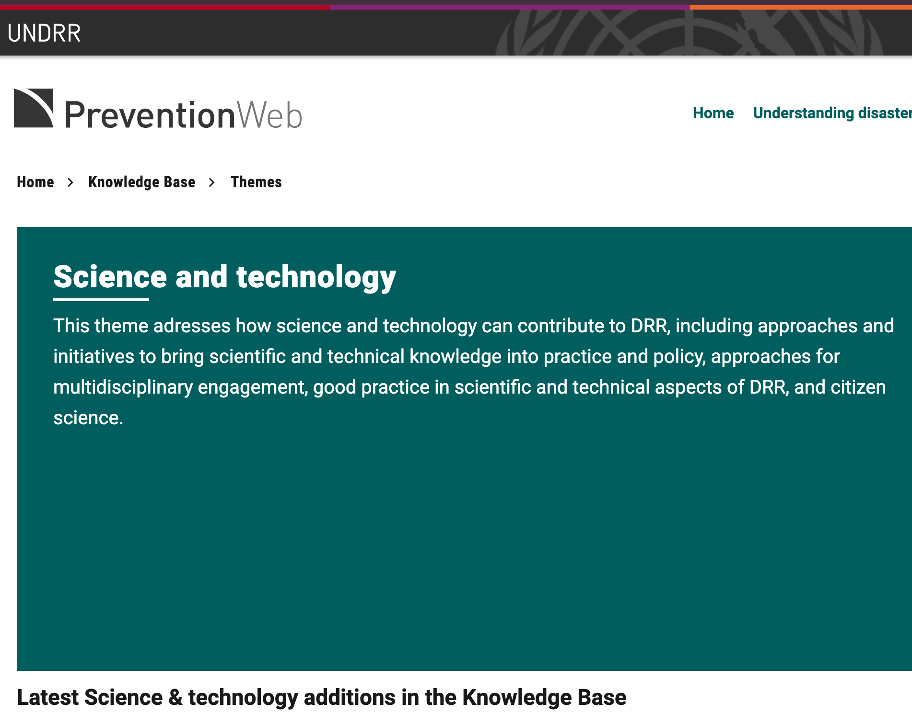

## Ciencia y tecnología en la gestión del riesgo de desastres

Esta sección reúne los recursos sobre el papel de la ciencia, la tecnología y la innovación (CTI) en la reducción del riesgo de desastres: la agenda internacional impulsada por UNDRR en el marco de Sendai, y el estado actual de su implementación regional.

:::::: mrw-cards-grid
::: mrw-card
::: mrw-card-header
[Ciencia y tecnología](cienciaytecnologia.qmd)
:::

::: mrw-card-body
{.mrw-card-img}

Evolución de la agenda internacional de ciencia, tecnología e innovación para la RRD en el marco de Sendai (2015–2026): hoja de ruta, compromisos, revisión de medio término y alertas tempranas para todos.
:::
:::

::: mrw-card
::: mrw-card-header
[Estado de la ciencia 2024](estado-ciencia.qmd)
:::

::: mrw-card-body
{.mrw-card-img}

Síntesis en español del informe *Status of Science and Technology in Disaster Risk Reduction in Asia Pacific* (UNDRR y AP-STAG, 2024): hallazgos, avance por prioridades de Sendai y recomendaciones.
:::
:::
::::::
