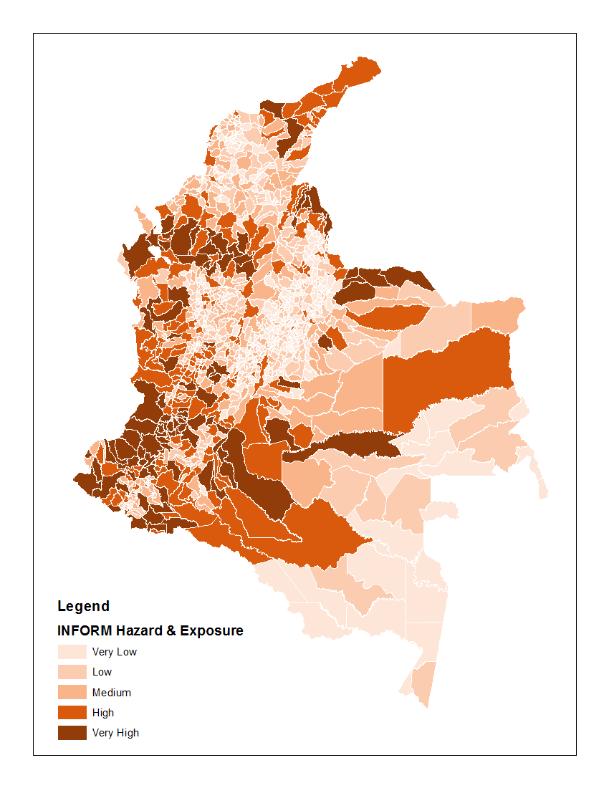
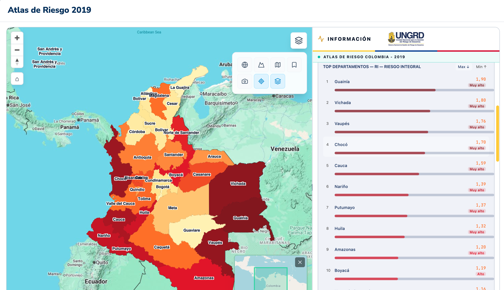
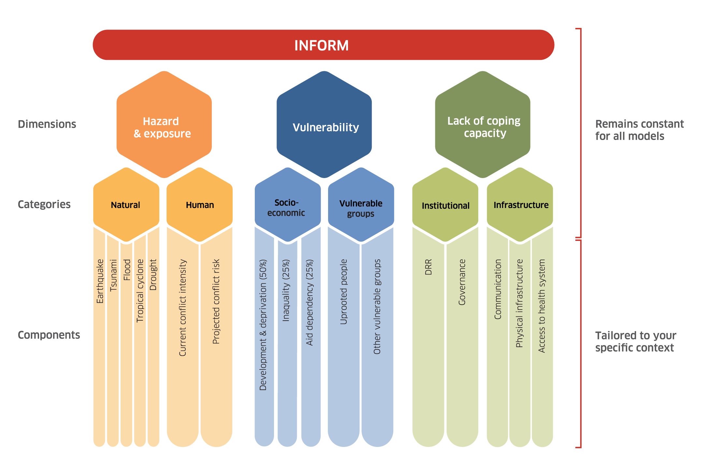
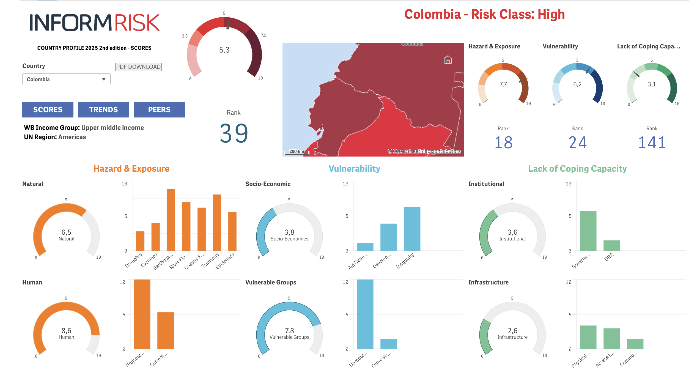
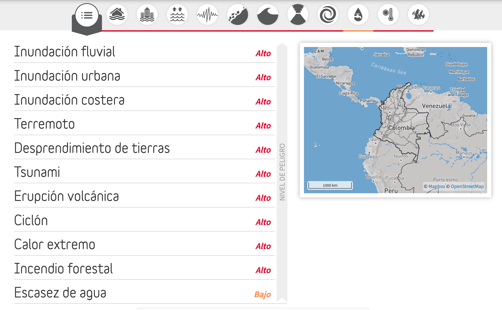
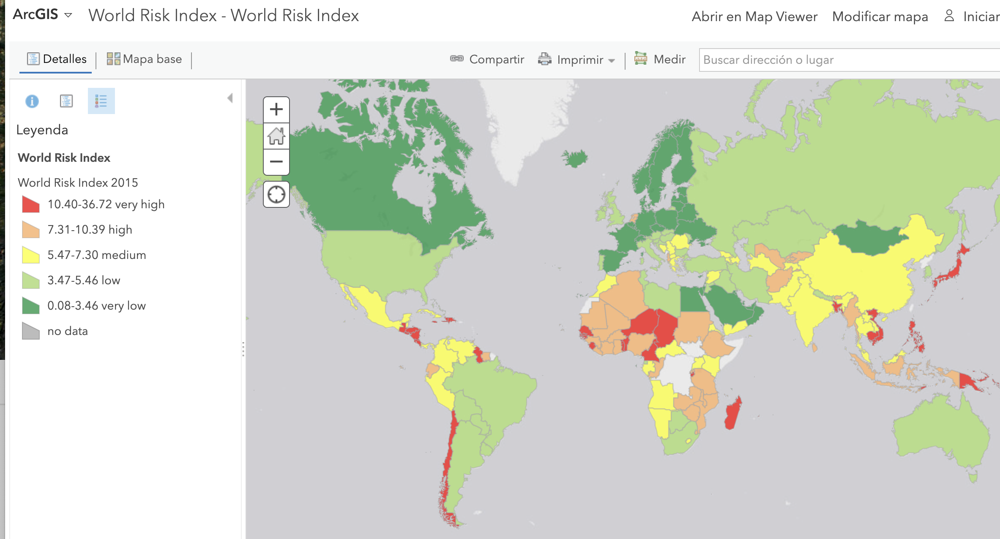
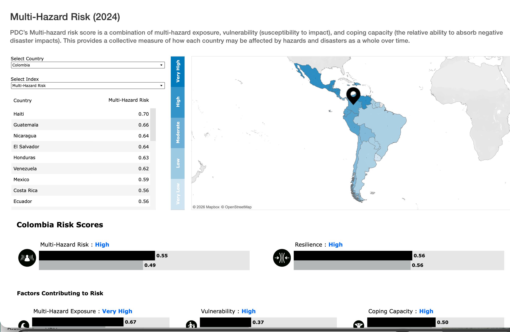

# Clasificación de riesgo departamental y municipal de Colombia

- Atlas de Riesgo de Colombia: revelando los desastres latentes. Unidad Nacional para la Gestión del Riesgo de Desastres. 2018. [*Link*](https://repositorio.gestiondelriesgo.gov.co/handle/20.500.11762/27179).
- COLOMBIA – Censo Nacional de Población y Vivienda – CNPV – 2018. [*Link*](http://microdatos.dane.gov.co/index.php/catalog/643/get_microdata).
- Datos del Consolidado de atención a emergencias. UNGRD. [*Link*](http://portal.gestiondelriesgo.gov.co/Paginas/Consolidado-Atencion-de-Emergencias.aspx).
- DESINVENTAR. Base de datos de pérdidas históricas en Colombia (período 1970-2011). [*Link*](http://online.desinventar.org/).
- CIPE. Colombia Risk Analysis: Subnational and Regional Risk Indices.[*Link*](https://www.cipe.org/resources/colombia-risk-analysis-special-report/). [*Link*](https://www.colombiariskanalysis.com/)*.*

::: panel-tabset
## INFORM subnational model of Colombia 2015

{fig-align="left" width="300"}

## Atlas del Riesgo de Colombia 2018

Atlas del Riesgo de Colombia: Revelando los Desastres Latentes. [*Link*](https://sni.gestiondelriesgo.gov.co/atlas-riesgo)

{width="300"}

## PDA Riesgo Departamental Multiamenaza 2025

Colombia: National Disaster Preparedness Baseline Assessment - A data-driven tool for assessing risk and building lasting resilience. [*Link*](https://reliefweb.int/report/colombia/colombia-national-disaster-preparedness-baseline-assessment-data-driven-tool-assessing-risk-and-building-lasting-resilience)

{width="300"}

## PDA Riesgo Municipal Multiamenaza 2025

Colombia: National Disaster Preparedness Baseline Assessment - A data-driven tool for assessing risk and building lasting resilience. [*Link*](https://reliefweb.int/report/colombia/colombia-national-disaster-preparedness-baseline-assessment-data-driven-tool-assessing-risk-and-building-lasting-resilience)

{width="300"}
:::

# Clasificaciones internacionales: Perfil de riesgo de Colombia

Colombia es un país con **riesgo mundial de desastres medio alto a muy alto (Tabla 1)** debido principalmente a su elevada exposición y vulnerabilidad.

La diferencia entre los resultados no representa necesariamente una contradicción. El WorldRiskIndex mide riesgo estructural de desastre; INFORM incorpora crisis humanitarias y capacidad de respuesta; Germanwatch mide daños meteorológicos ya ocurridos; ND-GAIN evalúa vulnerabilidad y preparación climática; y PDC se utiliza principalmente para análisis multiamenaza territorial y planificación operativa.

<html lang="es">

<head>

<meta charset="UTF-8">

<meta name="viewport" content="width=device-width, initial-scale=1.0">

<title>Colombia en Índices de Riesgo de Desastres</title>

```{=html}
<style>
  * { box-sizing: border-box; margin: 0; padding: 0; }
  body {
    font-family: 'Segoe UI', system-ui, sans-serif;
    background: #f7f6f3;
    color: #1a1a18;
    padding: 2rem 1.5rem;
    min-height: 100vh;
  }
  .header {
    margin-bottom: 2rem;
  }
  .header h1 {
    font-size: 1.35rem;
    font-weight: 600;
    color: #1a1a18;
    margin-bottom: 0.35rem;
    letter-spacing: -0.01em;
  }
  .header p {
    font-size: 0.85rem;
    color: #6b6a66;
    line-height: 1.5;
  }
  .section-label {
    font-size: 0.7rem;
    font-weight: 600;
    letter-spacing: 0.07em;
    text-transform: uppercase;
    color: #9c9b96;
    margin: 1.75rem 0 0.6rem;
    padding-left: 2px;
  }
  table {
    width: 100%;
    border-collapse: collapse;
    background: #ffffff;
    border-radius: 10px;
    overflow: hidden;
    box-shadow: 0 1px 3px rgba(0,0,0,0.07), 0 0 0 0.5px rgba(0,0,0,0.1);
    font-size: 0.875rem;
  }
  thead th {
    background: #f0efe9;
    padding: 0.75rem 1rem;
    text-align: left;
    font-size: 0.72rem;
    font-weight: 600;
    letter-spacing: 0.05em;
    text-transform: uppercase;
    color: #6b6a66;
    border-bottom: 0.5px solid rgba(0,0,0,0.1);
  }
  thead th:last-child { text-align: center; }
  tbody tr {
    border-bottom: 0.5px solid rgba(0,0,0,0.07);
    transition: background 0.12s;
  }
  tbody tr:last-child { border-bottom: none; }
  tbody tr:hover { background: #faf9f7; }
  td {
    padding: 0.85rem 1rem;
    vertical-align: top;
    line-height: 1.45;
    color: #1a1a18;
  }
  td:first-child {
    font-weight: 500;
    color: #1a1a18;
    white-space: nowrap;
  }
  td:nth-child(2) {
    color: #52514e;
    font-size: 0.83rem;
  }
  td:last-child {
    text-align: center;
  }
  .badge {
    display: inline-flex;
    align-items: center;
    gap: 5px;
    padding: 4px 10px;
    border-radius: 20px;
    font-size: 0.78rem;
    font-weight: 600;
    white-space: nowrap;
  }
  .badge-very-high { background: #fde8e8; color: #9b2020; }
  .badge-high      { background: #fdecd8; color: #8c4a0a; }
  .badge-high-moderate { background: #fef3d6; color: #7a5200; }
  .badge-moderate  { background: #e9f5e5; color: #2e6613; }
  .badge-low-moderate { background: #e3f0fb; color: #104782; }
  .dot {
    width: 7px; height: 7px; border-radius: 50%;
    flex-shrink: 0;
  }
  .dot-very-high { background: #d03b3b; }
  .dot-high      { background: #ec835a; }
  .dot-high-moderate { background: #e0a020; }
  .dot-moderate  { background: #3a8f1c; }
  .dot-low-moderate { background: #2a78d6; }
  .rank {
    font-size: 0.78rem;
    color: #9c9b96;
    display: block;
    margin-top: 2px;
    font-weight: 400;
  }
  .footer {
    margin-top: 1.5rem;
    font-size: 0.77rem;
    color: #9c9b96;
    line-height: 1.6;
  }
  .footer strong { color: #6b6a66; }
  .legend {
    display: flex;
    flex-wrap: wrap;
    gap: 10px 20px;
    margin-top: 1rem;
    padding: 0.85rem 1rem;
    background: #ffffff;
    border-radius: 8px;
    border: 0.5px solid rgba(0,0,0,0.1);
    font-size: 0.78rem;
  }
  .legend-item {
    display: flex;
    align-items: center;
    gap: 6px;
    color: #52514e;
  }
</style>
```

</head>

<body>

::: header
<h1>Colombia en índices internacionales de riesgo de desastres</h1>

<p>Comparativo de la posición de Colombia en los principales rankings globales de riesgo de desastres, cambio climático y vulnerabilidad. Fuentes con edición 2024–2026.</p>
:::

::: section-label
Riesgo de desastres y multiamenaza
:::

| Índice | Indicador / dimensión | Colombia |
|------------------------|------------------------|------------------------|
| WorldRiskIndex 2024 Bündnis Entwicklung Hilft / Univ. Bochum | Riesgo de desastre por amenazas naturales: combina exposición, vulnerabilidad, capacidad de afrontamiento y adaptación | Muy alto #4 de 193 países · score 37,8 Mayor riesgo en las Américas |
| INFORM Risk Index 2026 European Commission JRC / DRMKC | Riesgo de crisis humanitaria y desastre: hazards y exposición, vulnerabilidad y capacidad de respuesta institucional | Alto Score \~5,3 / 10 · posición media-alta Hazard humano (conflicto): muy alto |
| Pacific Disaster Center GRVI 2024 PDC – Global Risk & Vulnerability Index | Riesgo multiamenaza: combina exposición a múltiples amenazas, vulnerabilidad y capacidad de afrontamiento | Moderado-alto Clase de riesgo moderada a alta Alta exposición; capacidad coping media |
| ThinkHazard! (GFDRR / World Bank) Global Facility for Disaster Reduction and Recovery | Nivel de amenaza por tipo de peligro natural a nivel nacional | Alto en 10 amenazas Inundación, sismo, deslizamiento, tsunami, volcán, ciclón, calor extremo, incendio |

::: section-label
Riesgo climático y adaptación
:::

| Índice | Indicador / dimensión | Colombia |
|------------------------|------------------------|------------------------|
| Climate Risk Index 2026 Germanwatch | Impacto acumulado de eventos meteorológicos extremos (1995–2024): muertes, afectados y pérdidas económicas absolutas y relativas | Alto riesgo crónico No entre top-20 globales; afectaciones recurrentes por inundaciones y deslizamientos |
| ND-GAIN Country Index 2022 University of Notre Dame | Vulnerabilidad al cambio climático y preparación (readiness) para adaptarse: combina 45 indicadores de vulnerabilidad y 36 de preparación | Moderado-favorable #92 de 182 países · score 48,7 Vulnerabilidad baja-media; readiness media |
| World Bank Climate Knowledge Portal World Bank Group | Riesgo económico por múltiples amenazas: porcentaje de población y activos expuestos a dos o más peligros simultáneos | Muy alto #10 global en riesgo económico multiamenaza 84% poblac. / 86% activos en zona ≥2 amenazas |

::: section-label
Paz, fragilidad y capacidad institucional
:::

| Índice | Indicador / dimensión | Colombia |
|------------------------|------------------------|------------------------|
| Global Peace Index 2026 Institute for Economics & Peace | Nivel de paz societal, conflicto activo y militarización; incide en la capacidad de respuesta ante desastres y conflictos socioambientales | Bajo (poco pacífico) #140 de 163 países · score 2,735 Peor desempeño de América del Sur |
| INFORM Severity Index (mayo 2026) ACAPS / European Commission JRC | Severidad de crisis humanitarias activas: impacto, condiciones de afectados y complejidad del contexto | Severo Crisis activa catalogada por desplazamiento interno y conflicto armado persistente |

:::::::: legend
::: legend-item
Muy alto / Crítico
:::

::: legend-item
Alto
:::

::: legend-item
Moderado-alto
:::

::: legend-item
Moderado
:::

::: legend-item
Bajo-moderado
:::
::::::::

::: footer
<strong>Notas metodológicas.</strong> El WorldRiskIndex 2024 ubica a Colombia como el país de las Américas con mayor riesgo de desastre (#4 global), con un score de 37,8 sobre 100, impulsado principalmente por su altísima exposición a amenazas múltiples (31,5) y su vulnerabilidad moderada-alta (45,3). El INFORM Risk Index clasifica a Colombia con riesgo "Alto" (\~5,3/10), con la dimensión de amenaza humana —conflicto armado— como la más crítica (score muy alto). El ND-GAIN coloca a Colombia en una posición relativamente favorable respecto a otros países de la región en términos de preparación para adaptarse, aunque con desafíos en infraestructura y preparación ante desastres (score 0 en disaster preparedness). ThinkHazard! registra nivel "Alto" en 10 de 11 amenazas evaluadas, incluyendo inundación fluvial y urbana, costera, sismo, deslizamiento, tsunami, volcán, ciclón, calor extremo e incendio forestal. Datos con fecha de corte 2024–2026.
:::

</body>

</html>

------------------------------------------------------------------------

## Pacific Disaster Center

- Colombia’s data-driven approach to creating safer, more resilient communities. [*Link*](https://www.pdc.org/colombias-data-driven-approach-to-safer-resilient-communities/).
- NDPBA Colombia Final Report. 2025. [*Link*](https://www.pdc.org/document/ndpba-colombia-final-report/)*.*
- Pacific Disaster Center Multi Risk index 2024. [*Link*](https://analytics.pdc.org/global-risk-index/)*.*

------------------------------------------------------------------------

## DRMKC - Disaster Risk Management Knowledge Centre- Inform Risk

- DRMKC - Disaster Risk Management Knowledge Centre. [Link](https://drmkc.jrc.ec.europa.eu/)
- Inform Risk Index. [*Link*](https://drmkc.jrc.ec.europa.eu/inform-index)*. [Link](https://drmkc.jrc.ec.europa.eu/inform-index/INFORM-Risk/Country-Risk-Profile).*
- Inform Subnational Risk. [*Link*](https://drmkc.jrc.ec.europa.eu/inform-index/INFORM-Subnational-Risk).
- Latin America and Caribbean. [*Link*](https://drmkc.jrc.ec.europa.eu/inform-index/INFORM-Subnational-Risk/Latin-America-and-Caribbean/moduleId/1800/id/368/controller/Admin/action/Results)*.*
- INFORM subnational model of Colombia 2015 [*Link*](https://drmkc.jrc.ec.europa.eu/inform-index/INFORM-Subnational-Risk/Colombia).

::: panel-tabset
## INFORM Subnational Risk

{fig-align="left" width="300"}

## INFORM Colombia subnational model

{fig-align="left" width="300"}

## INFORM Colombia profile

INFORM Risk - Country Risk Profile: Colombia. Dashboard interactivo con el detalle de riesgo, peligro y exposición, vulnerabilidad y falta de capacidad de respuesta. [*Link*](https://drmkc.jrc.ec.europa.eu/inform-index/INFORM-Risk/Country-Risk-Profile).

{fig-align="left" width="400"}
:::

------------------------------------------------------------------------

## World Bank

Banco Mundial. Think hazard. Perfil de Colombia. [*Link*](https://thinkhazard.org/es/report/57-colombia)

/{width="400"}

------------------------------------------------------------------------

## World Risk Index

- World Risk Index. [*Link*](https://data.humdata.org/dataset/worldriskindex?). [*Link*](https://www.ireus.uni-stuttgart.de/en/International/WorldRiskIndex/)*.*

{fig-align="left" width="400"}

## The World Risk report

- The World Risk report. [*Link*](https://weltrisikobericht.de/worldriskreport/)*.*

{width="400"}

{width="400"}

## Pacific Disaster Center

- Multi-Hazard Risk (2024). [*Link*](https://analytics.pdc.org/global-risk-index/)

{width="400"}

## World Economic Forum

- Global Risks Report 2024. [*Link*](https://www.weforum.org/publications/global-risks-report-2024/digest/)

{fig-align="left" width="400"}

{fig-align="left" width="400"}

## Climate Risk Index 2026

The Climate Risk Index (CRI) ranks countries by the human and economic toll of extreme weather. The latest edition highlights increasing losses and the urgent need for stronger climate resilience and action. [Climate Risk Index: Most Affected Countries](https://www.germanwatch.org/en/cri):

<iframe src="https://app.23degrees.io/viewSub/DTdc6GfCKWqbBS4Q-atlas-climate-risk-index-2026-most/R0JnRIyrqitsvekp-choro-2024" width="100%" height="600" frameborder="0">

</iframe>

# Otras clasificaciones, recursos, e Índicadores mundiales

- ND-GAIN Country Index. Perfil de Colombia. University of Notre Dame. [*Link*](https://gain-new.crc.nd.edu/country/colombia).
- ODS. [*Link*](https://unstats.un.org/sdgs/report/2024/)
- United Nations Global Risk Report. [*Link*](https://unglobalriskreport.org/)
- Mapbiomas. [*Link*](https://plataforma.mapbiomas.org/)

::: panel-tabset
## Data sets

[](images/datasets.png){width="250"}](https://www.preventionweb.net/understanding-disaster-risk/disaster-losses-and-statistics/global-risk-data-sets)

## Flood observatory

[](images/floodobserv.png){width="250"}](https://floodobservatory.colorado.edu/index.html)
:::

# Indicadores regionales

- BID. [*Link*](https://www.iadb.org/es/quienes-somos/temas/ambiente-y-desastres-naturales/iniciativas/preparados-y-resilientes-en-las-americas)
  - Risk Monitor. BID. [*Link*](https://riskmonitor.iadb.org/disaster-risk-profiles)

## Lecturas

- Natural hazard risk assessments at the global scale. 2020. NHESS. [*Link*](https://nhess.copernicus.org/articles/20/1069/2020/)*.*
- Is the number of global natural disasters increasing? 2022. Environmental Hazards. [*Link*](https://www.tandfonline.com/doi/abs/10.1080/17477891.2023.2239807)*.*
- Incompleteness of natural disaster data and its implications on the interpretation of trends. 2024. Environmental Hazards. [*Link*](https://www.tandfonline.com/doi/full/10.1080/17477891.2024.2377561)*.*
- The number of natural disasters is zero: commentary to “is the number of global natural disasters increasing?” 2024. [*Link*](https://link.springer.com/article/10.1007/s11069-025-07245-9)*.*
- Comments on the short communication: The number of natural disasters is zero: commentary to “Is the number of global natural disasters increasing?” 2025. [*Link*](https://link.springer.com/article/10.1007/s11069-025-07710-5#ref-CR5)*.*
- Is the number of natural disasters increasing? 2024. [*Link*](https://ourworldindata.org/disaster-database-limitations).
- Weather-related disasters increase over past 50 years, causing more damage but fewer deaths. 2021. OMS. [*Link*](https://wmo.int/media/news/weather-related-disasters-increase-over-past-50-years-causing-more-damage-fewer-deaths#:~:text=Climate%20change-,A%20disaster%20related%20to%20a%20weather%2C%20climate%20or%20water%20hazard,US$%203.64%20trillion%20in%20losses.)*.*
- Official statistics are vastly undercounting deaths from extreme weather. Nature 2025 [*Link*](https://www.nature.com/articles/d41586-025-03669-2)

```{=html}
<iframe src="https://ourworldindata.org/grapher/number-of-natural-disaster-events?tab=line" loading="lazy" style="width: 100%; height: 600px; border: 0px none;" allow="web-share; clipboard-write"></iframe>
```

```{=html}
<iframe src="https://ourworldindata.org/grapher/natural-disasters-reported-by-deaths?tab=line" loading="lazy" style="width: 100%; height: 600px; border: 0px none;" allow="web-share; clipboard-write"></iframe>
```

## EmDat

- EM-DAT International Disaster Database. [*Link*](https://www.emdat.be/)*.*
  - EM-DAT Documentation. [*Link*](https://doc.emdat.be/docs/).
  - EM-DAT: the Emergency Events Database. [*Link*](https://www.sciencedirect.com/science/article/pii/S2212420925003334?via%3Dihub)

{width="500" height="175"}

 EmDat

# Indicadores latinoamericanos

- Atlas de riesgos. Secretaría de Gestión Integral de Riesgos y Protección Civil, Gobierno de la Ciudad de México. [*Link*](https://www.atlas.cdmx.gob.mx/principal/inicio)

# Videos

::: {layout-ncol="2"}
 World Risk Index

 INFORM Subnational Risk Index in Europe & Central Asia

 INFORM Subnational Risk Analysis Training - Module 1
:::

# Otras bases de datos

- Plataforma para las Américas. [*Link*](https://eird.org/pr18/eng/).
- Atlas de Riesgos Climáticos para Chile. [*Link*](https://arclim.mma.gob.cl/).
- Mapa digital de amenazas y desastres de Chile. [*Link*](https://chileterritorioenmovimiento.cl/mapa-interactivo/).
- NatCatSERVICE Database. [*Link*](https://www.munichre.com/en/solutions/for-industry-clients/natcatservice.html).
- SIGMA (Swiss Re). [*Link*](https://www.sigma-explorer.com/).
- GLobal unique disaster IDEntifier (GLIDE). [*Link*](https://glidenumber.net/glide/public/about.jsp).
- Metabuscador Climate Adapt. [*Link*](https://climate-adapt.eea.europa.eu/data-and-downloads/?source=%7B%22query%22%3A%7B%22function_score%22%3A%7B%22query%22%3A%7B%22bool%22%3A%7B%22must%22%3A%7B%22bool%22%3A%7B%22must%22%3A%5B%7B%22term%22%3A%7B%22hasWorkflowState%22%3A%22published%22%7D%7D%5D%7D%7D%2C%22filter%22%3A%7B%22bool%22%3A%7B%22should%22%3A%5B%7B%22term%22%3A%7B%22typeOfData%22%3A%22Information%20portals%22%7D%7D%5D%7D%7D%7D%7D%2C%22functions%22%3A%5B%7B%22gauss%22%3A%7B%22issued%22%3A%7B%22scale%22%3A%2214d%22%7D%7D%7D%5D%2C%22score_mode%22%3A%22sum%22%7D%7D%2C%22display_type%22%3A%22list%22%2C%22sort%22%3A%5B%7B%22issued%22%3A%7B%22order%22%3A%22desc%22%7D%7D%5D%2C%22highlight%22%3A%7B%22fields%22%3A%7B%22*%22%3A%7B%7D%7D%7D%7D).
- GDIS, a global dataset of geocoded disaster locations. Scientific Data. 2021. [*Link*](https://www.nature.com/articles/s41597-021-00846-6).
- World tectonic plates and boundaries. Github. [*Link*](https://github.com/fraxen/tectonicplates/)
- The Lloyd’s Register Foundation World Risk Poll. [*Link*](https://wrp.lrfoundation.org.uk/data-resources/a-world-of-risk-country-overviews/).
- LEILA – Librería de calidad de datos. DNP. [*Link*](https://ucd-dnp.github.io/leila/index.html)
- OECD. [*Link*](https://www.oecd.org/).
  - OECD One. [*Link*](https://one.oecd.org/). [*Link*](https://login.oecd.org/?appId=293718&targetAppId=18060&referer=https%3A%2F%2Fone.oecd.org%2F). [*Tutorials*](https://community.oecd.org/community/one-feedback/tutorials). [Co-creation project](https://community.oecd.org/community/cstp/tip/cocreation)
- United Nations Climate Change. [*Link*](https://www4.unfccc.int/sites/nwpstaging/pages/Search.aspx).
- **Lecturas**:
  - Worldwide disaster loss and damage databases: A systematic review. 2021. [*Link*](https://www.jehp.net/article.asp?issn=2277-9531;year=2021;volume=10;issue=1;spage=329;epage=329;aulast=Mazhin).
- Ejemplos de indicadores estatales o departamentales
  - Natural Hazard Risk Assessment. Weather.gov. [*Link*](https://www.weather.gov/rlx/HazardRiskAssessment)