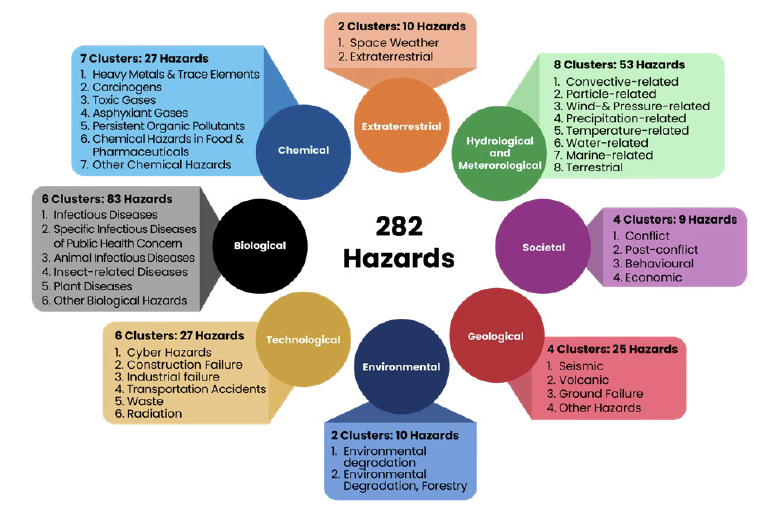

## Gestión del riesgo de desastres

Esta sección reúne recursos sobre gestión del riesgo de desastres (GRD) en Colombia y a nivel internacional: el marco legal y los cuatro procesos de la política nacional (conocimiento, reducción, manejo de desastres y ciencia y tecnología), indicadores y amenazas por categoría, educación, cursos, redes, repositorios, sistemas de alerta temprana y terminología.

:::::: mrw-cards-grid
::: mrw-card
::: mrw-card-header
[Gestión del riesgo de desastres](gestiondelriesgo.qmd)
:::

::: mrw-card-body
Marco legal colombiano de la gestión del riesgo de desastres: la Ley 1523 de 2012, el Sistema Nacional de Gestión del Riesgo de Desastres y la normativa que lo desarrolla.
:::
:::

::: mrw-card
::: mrw-card-header
[Conocimiento del riesgo](conocimientodelriesgo.qmd)
:::

::: mrw-card-body
El primer proceso de la política nacional de GRD: identificación, análisis y evaluación del riesgo, y el marco normativo asociado.
:::
:::

::: mrw-card
::: mrw-card-header
[Indicadores de riesgo nacionales y mundiales](conocimiento-indicadores.qmd)
:::

::: mrw-card-body
Clasificación de riesgo departamental y municipal de Colombia, el Atlas de Riesgo, censos y bases de datos de pérdidas históricas como DesInventar.
:::
:::

::: mrw-card
::: mrw-card-header
[Reducción del riesgo](reducciondelriesgo.qmd)
:::

::: mrw-card-body
Planes municipales de gestión del riesgo (PMGRD): guía metodológica de la UNGRD para su formulación y actualización.
:::
:::

::: mrw-card
::: mrw-card-header
[Manejo de desastres](manejodedesastres.qmd)
:::

::: mrw-card-body
Instituciones internacionales y nacionales de respuesta humanitaria y manejo de desastres.
:::
:::

::: mrw-card
::: mrw-card-header
[Ciencia y tecnología](cienciaytecnologia/index.qmd)
:::

::: mrw-card-body
{.mrw-card-img}

El papel de la ciencia, la tecnología y la innovación en la reducción del riesgo de desastres, en el marco de Sendai y la agenda de UNDRR.
:::
:::

::: mrw-card
::: mrw-card-header
[Educación](educacion.qmd)
:::

::: mrw-card-body
Leyes, decretos, programas y estrategias de educación en gestión del riesgo de desastres en Colombia.
:::
:::

::: mrw-card
::: mrw-card-header
[Cursos en GRD](cursos.qmd)
:::

::: mrw-card-body
Centros, entrenamientos y redes internacionales de formación en gestión del riesgo de desastres.
:::
:::

::: mrw-card
::: mrw-card-header
[Plataformas y redes](plataformas-redes.qmd)
:::

::: mrw-card-body
La Plataforma Global para la Reducción del Riesgo de Desastres de UNDRR y otras plataformas y redes internacionales.
:::
:::

::: mrw-card
::: mrw-card-header
[Repositorios FAIR](repositorios.qmd)
:::

::: mrw-card-body
Repositorios FAIR y de ciencia de datos en gestión del riesgo de desastres, en Colombia y a nivel internacional.
:::
:::

::: mrw-card
::: mrw-card-header
[Sistemas de alerta temprana](sat.qmd)
:::

::: mrw-card-body
Sistemas de Alerta Temprana: de la iniciativa *Early Warnings for All* al SIATA de Medellín y el Valle de Aburrá.
:::
:::

::: mrw-card
::: mrw-card-header
[Amenazas hidrológicas y meteorológicas](hidrol-meteorologicas/index.qmd)
:::

::: mrw-card-body
{.mrw-card-img}

El Niño / La Niña, huracanes, inundaciones, inundaciones repentinas y olas de calor.
:::
:::

::: mrw-card
::: mrw-card-header
[Amenazas geológicas](geologicas/index.qmd)
:::

::: mrw-card-body
Falla de terreno, riesgo sísmico, tsunami y volcanes.
:::
:::

::: mrw-card
::: mrw-card-header
[Amenazas ambientales](ambientales/index.qmd)
:::

::: mrw-card-body
Erosión costera e incendios forestales.
:::
:::

::: mrw-card
::: mrw-card-header
[Amenazas biológicas](biologicos/index.qmd)
:::

::: mrw-card-body
COVID-19 y otras amenazas biológicas.
:::
:::

::: mrw-card
::: mrw-card-header
[Amenazas tecnológicas](tecnologicas/index.qmd)
:::

::: mrw-card-body
Amenazas tecnológicas y su relación con la gestión del riesgo de desastres.
:::
:::

::: mrw-card
::: mrw-card-header
[Amenazas sociales](sociales/index.qmd)
:::

::: mrw-card-body
Migración y otras amenazas de origen social.
:::
:::

::: mrw-card
::: mrw-card-header
[Amenazas extraterrestres](extraterrestre/index.qmd)
:::

::: mrw-card-body
Amenazas de origen extraterrestre y su lugar en la clasificación de amenazas de la GRD.
:::
:::

::: mrw-card
::: mrw-card-header
[Amazonas](amazonas.qmd)
:::

::: mrw-card-body
Sistemas de información y redes de monitoreo de la Amazonía: MapBiomas, el Observatorio Regional del Amazonas y los conflictos socioambientales del territorio.
:::
:::

::: mrw-card
::: mrw-card-header
[Ciudades](ciudades.qmd)
:::

::: mrw-card-body
Riesgo de desastres en ciudades: estrés térmico y otros riesgos propios del entorno urbano.
:::
:::

::: mrw-card
::: mrw-card-header
[Terminología](glosario.qmd)
:::

::: mrw-card-body
Glosarios internacionales y nacionales de referencia en gestión del riesgo de desastres.
:::
:::
::::::
